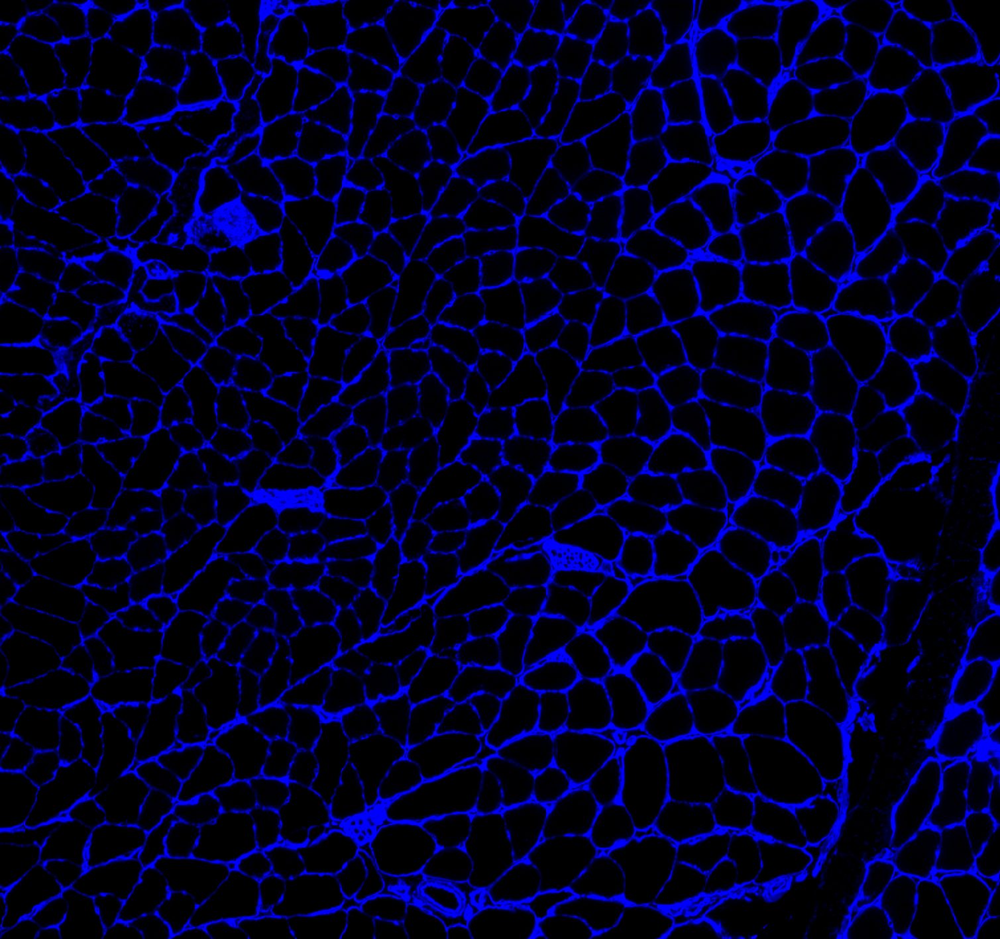
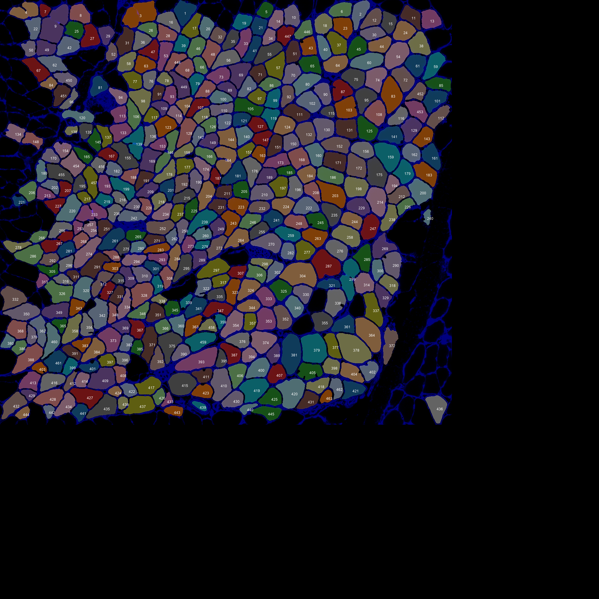
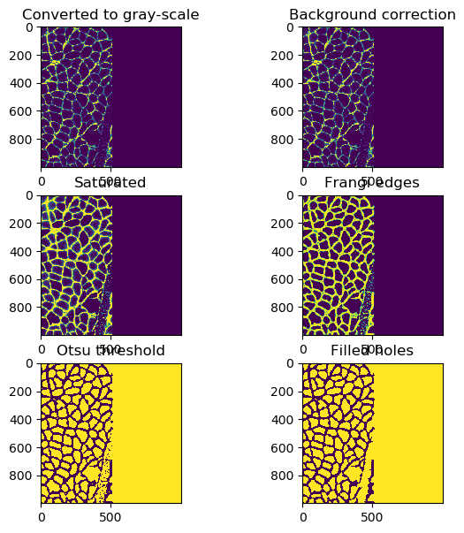

### Overview

Research-grade images of muscle cross-sections can be very large (often more than 5000 x 5000 pixels). This can lead to problems with running out of computer memory.

Python_MyoVision tries to overcome this problem using block processing - in essence, analyzing bits of the image in sequence when possible.

### Instructions

1. Open a command prompt
   + If you don't know how
     + type cmd in the Search field of your Start Menu
     + or Google it to find instructions that work for you

1. Change the directory to the Python_code folder of your repository
   + If you installed Python_MyoVision in `c:\users\your_username_here\GitHub\Python_Myovision`  
you can type  
`cd c:\users\your_username_here\GitHub\Python_Myovision\Python_code`  
and press enter

1. In the command window, type  
python py_vision.py analyze_images "..\demos\example_B\configuration_data\configuration_data.xml"  
and press enter

1. Within a few seconds, you should see status updates in the command window

1. Once the program has finished, look in the results folder specified in the configuration file.
   + By default that should be  
`c:\users\your_username_here\GitHub\Python_Myovision\demos\example_B\results`  

1. You should see the following files:
   + final_results.xlsx
   + clean_overlay.png
   + annotated_overlay.png
   + processing.zip

1. Here is the original image
    
    
    
1. Here is the clean_overlay.png file  
    
    
    
1. Here is the annotated_overlay.png file
    
    
    
1. You can see that the overlays are larger than the original - in other words, they were padded.

1. What happened, was that MyoVision detected that the original image (1509 x 1408 pixels) was larger than 1000 x 1000 pixels (the threshold value is defined by the `block_size` in `<image_to_label_parameters>` in the configuration file). It therefore split the original image into blocks of 1000 x 1000, padding the right-hand side and the bottom-edge with black areas as necessary during the image processing.
   + You can see the individual blocks by opening up `processing.zip` in the results folder and looking inside the `blocks` sub-folder
   + Here's how the top-right block was processed
   
     
     
