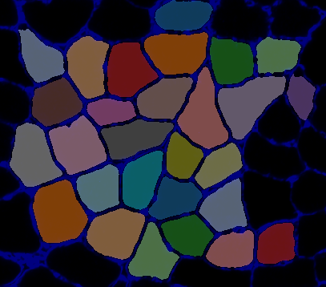
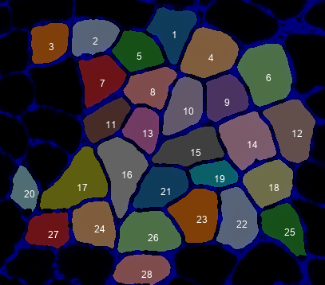

### Overview

These instructions show you how to run a simple demo which analyzes a small test image.

### Instructions

1. Open a command prompt
   + If you don't know how
     + type cmd in the Search field of your Start Menu
     + or Google it to find instructions that work for you

1. Change the directory to the Python_code folder of your repository
   + If you installed Python_MyoVision in `c:\users\your_username_here\GitHub\Python_Myovision`  
you can type  
`cd c:\users\your_username_here\GitHub\Python_Myovision\Python_code`  
and press enter

1. In the command window, type  
python py_vision.py analyze_images "..\demos\example_A\configuration_data\configuration_data.xml"  
and press enter

1. Within a few seconds, you should see status updates in the command window

1. Once the program has finished, look in the results folder specified in the configuration file.
   + By default that should be  
`c:\users\your_username_here\GitHub\Python_Myovision\demos\example_A\results`  

1. You should see the following files:
   + final_results.xlsx
   + clean_overlay.png
   + annotated_overlay.png
   + processing.zip

1. Here is the clean_overlay.png file  

1. Here is the annotated_overlay.png file  

1. Now go to [What MyoVision did](../what-myovision-did/what-myovision-did.html) to learn more about what the program did.

