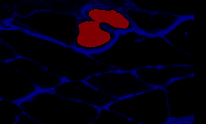

### Overview

The goal here is to create a new Excel file that includes the metrics for each blob and an additional column marking the blob as:
  + a plausible fiber (code 1)
  + potentially connected fibers (code 2)
  + something else, for example, interstitial space (code 3)

This has to be done manually, because people are better at classifying things than computers, until the computer has rules to follow. This may take a while.

### Instructions

1. Copy blob_metrics.xlsx to `..\demos\example_C\results\manual_classification\manual_classification.xlsx`

1. Open `manual_classification.xlsx`

1. Delete the first two columns (one has no entry, the other is called `label`)
   + This is necessary because neither of these columns will tell you anything about whether or not a blob is a fiber

1. Add a new column, called `classification`

1. Now open `annotated_overlay.png` from the `..\demos\example_C\results` folder
   + You can use any image tool you like for this, but [IrfanView](http://www.irfanview.com) is good if you don't have a favorite
   + Zoom in on the image, and move around until you find the blob labeled 1. It's probably near the top somewhere.

1. Now open `blob_1.png` from the `..\demos\example_C\results\blobs` folder

   + You should see that its a sub-image of the blob labeled 1 in the annotated overlay
   
       
        
   + Go to the Excel file, and in the column called `classification`, mark the status of blob 1 as:
     + 1, a plausible fiber
     + 2, potentially-connected fibers
     + 3, something else
     
   + If you are not sure, use the annotated_overlay.png file to help you make a decision
   
   + Don't worry if the blob doesn't 'quite fill the boundary' - it's not supposed to at this stage.
   
   + Then again, if the blob is a tiny speck in a big fiber, it's not a good representation of the fiber so mark it as a 3.
   
   + If the blob is 'connected' but seems to link a plausible fiber with something that is not a plausible fiber, mark it as a 2
   
   + It's unlikely that you will be able to assign everything perfectly, and without some ambiguity - just do your best.
   
   + Finally, remember that:
     + blob 1 is in row 2 of the Excel file
     + blob 2 is in row 3 of the Excel file
     + and so on

1. Work your way through all of the blobs, until you have classified everything MyoVision detected
   + Remember to save your Excel file frequently, and once again at the end 
   
