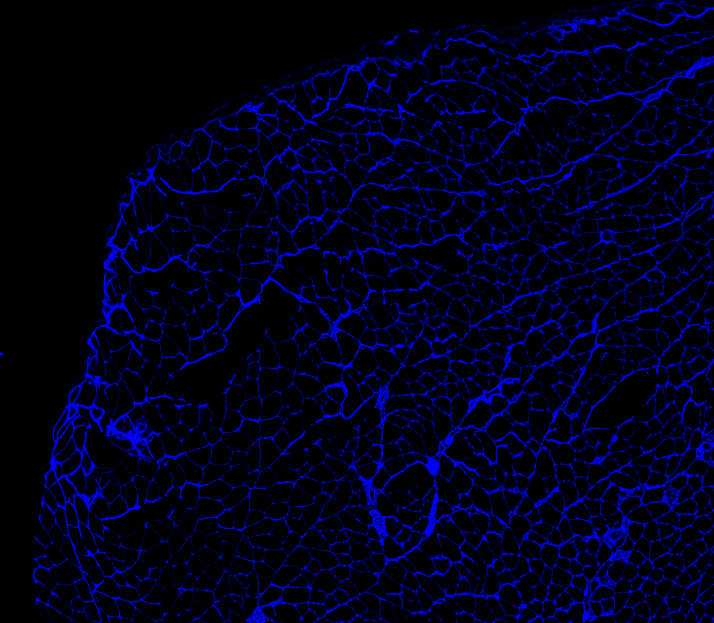
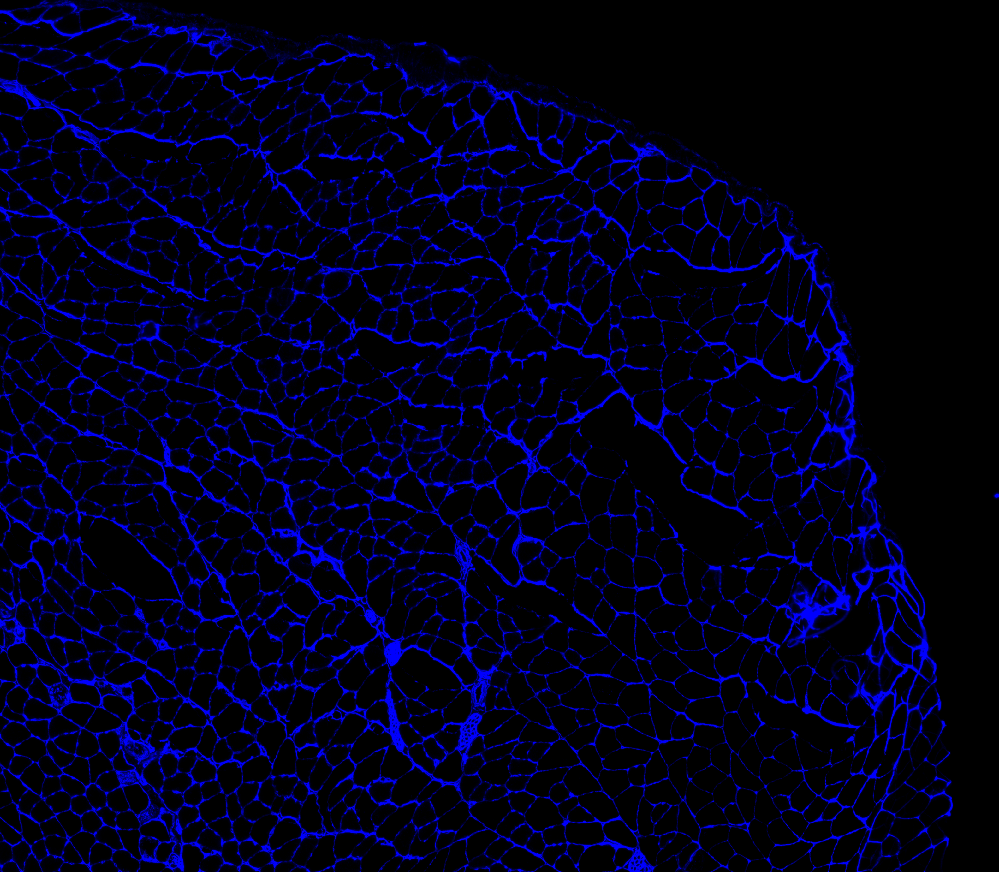
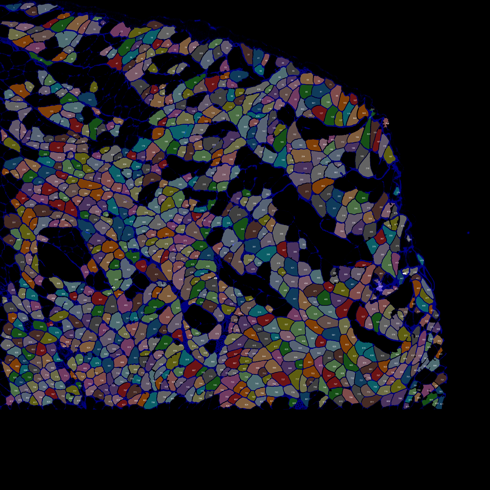

### Overview

The prior steps in [this tutorial](../creating-a-new-classifier.html) showed you how to:
+ identify blobs in a gray-scale image
+ segregate the blobs into different categories
+ create a classifier system that allocates new blobs to different categories

Once you have created a new classifier, it's a good idea to test it on a new image. If it works, you can be more confident that the classifier is doing what you want it to.

### Instructions

1. A simple approach is to test the classifier on a flipped version of the original image file.  

Here's the original image we used to train the classifer.  

Here's a flipped version that we will use to to test our system.  

1. Now have a look at `flipped_image.xml` in `..\demos\example_C\configuration_data\flipped_image.xml`

1. By now, you can probably see that it is going to run a standard analysis, just like [Analyze a larger image](../../analyze-a-larger-image/analyze-a-larger-image.html) on the flipped image.

1. Open a command window and change to the directory containing your Python code - see [Analyzing a small image](../../analyze-a-small-image/analyze-a-small-image.html) if you need help.

1. Now type  
`python py_vision.py analyze_images "..\demos\example_C\configuration_data\flipped_image.xml"`  
and press enter

1. The code should run, and in the results folder, you should find the following annotated image.  

