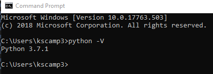

Python_MyoVision is written in a computer language called, you guessed it, [Python](https://www.python.org/). The code also uses additional Python packages (including Numpy, Scipy, Panadas, and Scikit-learn) which provide specialized support for scientific computing and image processing.

The easiest way to install Python and all of the necessary packages is to use the [Anaconda distribution](https://www.anaconda.com/distribution/).

### Instructions

+ Read the [Installation instructions](https://docs.anaconda.com/anaconda/install/windows/) for Anaconda.
+ Note that during the installation
  + if you are given the option of installing Python 3.something or Python 2.something, install the newer Python 3.x something version.
  + you will have the option of adding Anaconda to your PATH environment variable. Although it is not the default, we want to do this for MyoVision.
+ Now go ahead, and install Anaconda, following the instructions, and adding Anaconda to your PATH environment variable when you get to the appropriate step.
+ Check the installation by:
  + opening a command prompt (Run->cmd, or type cmd in the Windows Search box)
  + typing "python -V" and pressing enter
  + you should see something like this  

  + if you get an error, or don't see a version number starting with 3.something try [this troubleshooting page](https://docs.anaconda.com/anaconda/user-guide/troubleshooting/)

