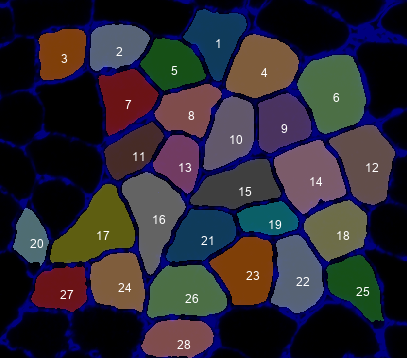
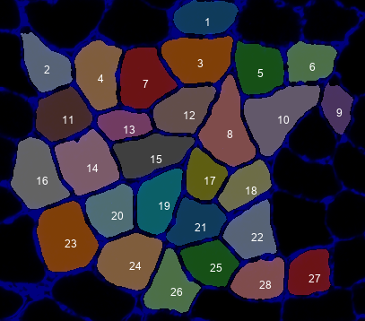

### Overview

These instructions show you how to run a simple demo which analyzes three images in sequence. You can use this technique to analyze multiple images in a batch.

### Instructions

+  Make sure you
   + have run [Analyze a small image](../analyze-a-small-image/analyze-a-small-image.html)
   + have a good understanding of what the code did

+  Now look in the `demos` folder of your repository and find the `configuration_data.xml` file for example_D. It should look like this.

~~~~
<?xml version="+ 0" encoding="windows-1252"?>
<MyoVision_analysis>
  <task_files>
    <task>
      <raw_image_file_string>..\demos\example_D\raw_images\image_+ png</raw_image_file_string>
      <results_folder>..\demos\example_D\results\image_1</results_folder>
    /task>
    <task>
      <raw_image_file_string>..\demos\example_D\raw_images\image_2.png</raw_image_file_string>
      <results_folder>..\demos\example_D\results\image_2</results_folder>
    </task>
    <task>
      <raw_image_file_string>..\demos\example_D\raw_images\image_3.png</raw_image_file_string>
      <results_folder>..\demos\example_D\results\image_3</results_folder>
    </task>
  </task_files>
  
  <image_to_label_parameters>
    <block_size>1000</block_size>
    <saturation_percent>10</saturation_percent>
    <min_object_size>50</min_object_size>
    <watershed_distance>10</watershed_distance>
  </image_to_label_parameters>

  <classifier_parameters>
    <classification_model_file_string>..\demos\example_A\classification_model\classification_model.svc</classification_model_file_string>
  </classifier_parameters>
  
  <refine_fibers_parameters>
    <max_iterations>15</max_iterations>
    <sigma>2</sigma>
  </refine_fibers_parameters>
</MyoVision_analysis>
~~~~

+  The key thing about this configuration file is that it has 3 tasks instead of just + 
   + the first task analyzes `image_1 png` and stores the results in the `results\image_1` folder
   + the second task analyzes `image_2.png` and stores the results in the `results\image_2` folder
   + the third task analyzes `image_3.png` and stores the results in the `results\image_3` folder  

+  That's basically it. You can instead this technique for any number of image files, simply by adding new tasks to your configuration file.

+  To run the demo, open a command prompt
   + If you don't know how
     + type cmd in the Search field of your Start Menu
     + or Google it to find instructions that work for you  

+  Change the directory to the Python_code folder of your repository
   + If you installed Python_MyoVision in `c:\users\your_username_here\GitHub\Python_Myovision`  
you can type  
`cd c:\users\your_username_here\GitHub\Python_Myovision\Python_code`  
and press enter  

+  In the command window, type  
python py_vision.py analyze_images "..\demos\example_D\configuration_data\configuration_data.xml"  
and press enter

+  Within a few seconds, you should see status updates in the command window

+  Once the program has finished, look in the results folder specified in the configuration file.
   + By default that should be  
`c:\users\your_username_here\GitHub\Python_Myovision\demos\example_A\results`  

+  You should see 3 folders:
   + results_1
   + results_2
   + results_3  
   
+  Inside each of them, you should see the following files:
   + final_results.xlsx
   + clean_overlay.png
   + annotated_overlay.png
   + processing.zip

Here are the results:

+ Image 1

    
  
    

+ Image 2

    
  
    

+ Image 3

    
  
    

