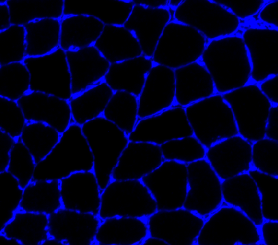

### Algorithm worflow

When you ran the example, MyoVision:

+ opened a configuration file (`configuration_data.xml`) stored in `..\demos\example_A\configuration_data`.
  + looked at the task file section
    + saw one task specified with
      + an input image file `PoWer_3_Gastroc_10x_blue_cropped_small.png` stored in `..\demos\example_A\raw_image`
      + results to be written to `..\demos\example_A\results`

+ ran the task by:

  1. reading in the input image file
  
      
 
  1. converting it to gray-scale
  
     
  
  1. saturating the image
     + this step adjusts the brightness and contrast of the gray-scale image until x percent of the pixels are as dark as they can be, and x percent are as light as they can be
     + the x value, in this case 10%, is set by the `saturation percent` variable in the `<image_to_label_parameters>` of the configuration file
     
     
     
  1. enhancing the cell edges using a Frangi filter
       
  1. performing an initial segmentation to identify 'blobs' - regions of connected pixels
     + discarding blobs with an area below a critical size
     + the critical size, in this case 50 pixels, is set by the `min_object_size` in the `<image_to_label_parameters>` of the configuration file
  
     

  1. loading a classifier model (more on this later) set by `classification_model_file_string` in the `<classifier_parameters>` section of the configuration file
  1. using the classifier to mark each blob as one of the following:
     + fiber
     + potentially-connected fibers (two or more fibers separated by an incomplete cell boundary)
     + something else
     
     
     
  1. attempting to separate potentially-connected fibers into single fibers
     + this is done using a watershed algorithm and a `watershed_distance_parameter` (in this case, 10 pixels) defined in the `<image_to_label_parameters>` section of the configuration file
     
       
       
     
  1. refining the edges of each cell using an adaptive contour technique which depends on the following parameters which are defined in the `<refine_fibers_parameters>` section of the configuration file:
     + max_iterations
     + sigma
     
       
       
       
     
  1. re-segmenting the image to identify fibers with improved fidelity
  
       
       
    
  1. correcting for fibers that were inappropriately connected during the fiber refinement step
  
       
       
  
  1. creating the following output files in `results_folder` (which was specified for the task in the `<task_files>` section of the configuration file
  
     + an Excel file `final_results.xlsx` containing the following metrics for each fiber:
     
       + label (the id for the fiber)
       + area (in pixels)
       + eccentricity (0 is a circle, 1 is a straight line)
       + convex area (in pixels)
       + equivalent diameter (in pixels)
       + extent (ratio of pixels in the blob to the pixels in the total bounding box)
       + major axis length (in pixels)
       + minor axis length (in pixels)
       + orientation (angle between horizontal and the major axis of the equivalent ellipse - ranges from -pi/2 to +pi/2)
       + perimeter (in pixels)
       + solidity (ratio of pixels in the blob to the pixels in the convex hull image)
       
     + an image file `clean_overlay.png` showing falsely-colored fibers overlaid on the original input image
     
     + an image file `annotated_overlay.png` showing falsely-colored fibers overlaid on the original input image with text labels showing the fiber IDs
     
     + a zip file `processing.zip` which can be useful for trouble-shooting and which contains:
     
       + a folder named `blocks` with images showing processing steps for individual [blocks](analyze-a-bigger-image.html)
       + a folder named `classification_steps` with images showing the results of the processing steps outlined above
       